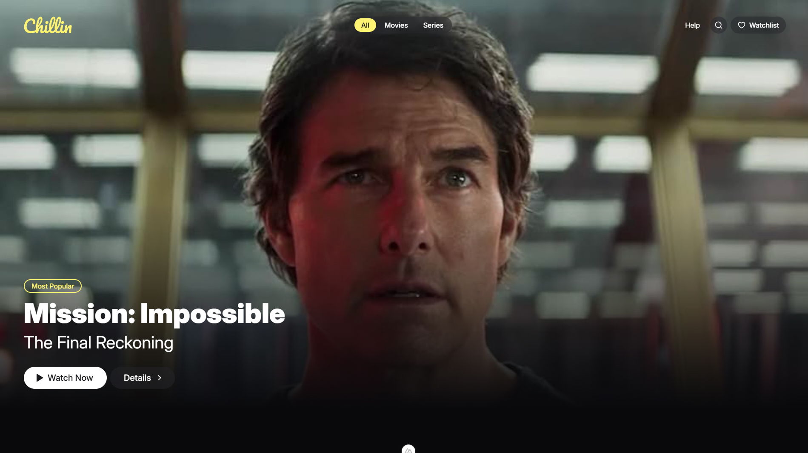

# Chillin.video



## Design
Figma: https://www.figma.com/design/4zOl1cxLcx3tQoKmsEAnSL/Chillin-Video-Streaming?node-id=0-1&t=Mkb1r3hRU5prf4lU-1

## Setup

Make sure to install dependencies:

```bash
npm install
```

Configure environment variables:
1. Rename `.env.example` to `.env`
2. Add your `OMDB_API_KEY`

## Development Server

Start the development server on `http://localhost:3000`:

```bash
npm run dev
```

## Production

Build the application for production:

```bash
npm run build
```

Locally preview production build:

```bash
npm run preview
```

Check out the [deployment documentation](https://nuxt.com/docs/getting-started/deployment) for more information.

## Tech stack
- Vue
- Nuxt 3
- Tailwind CSS
- Vite
- Pinia
